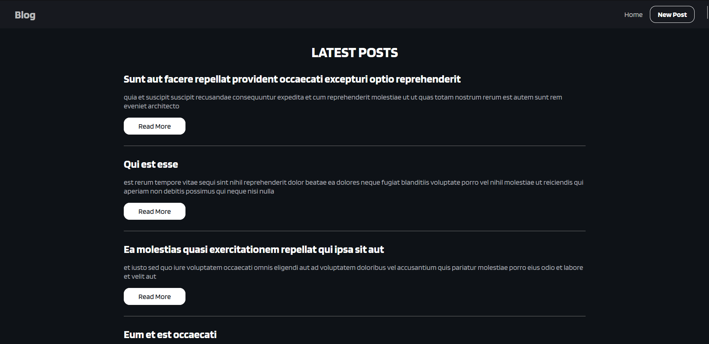
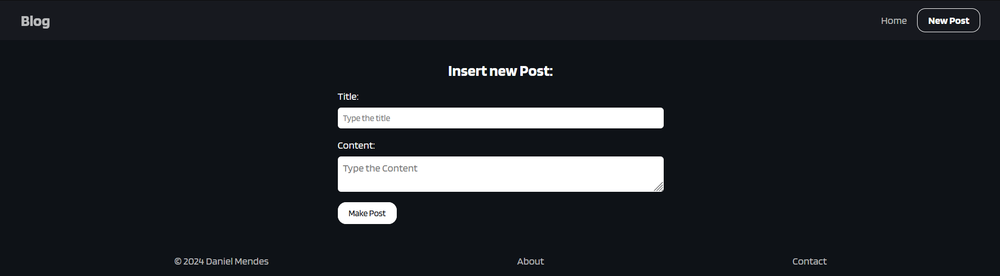
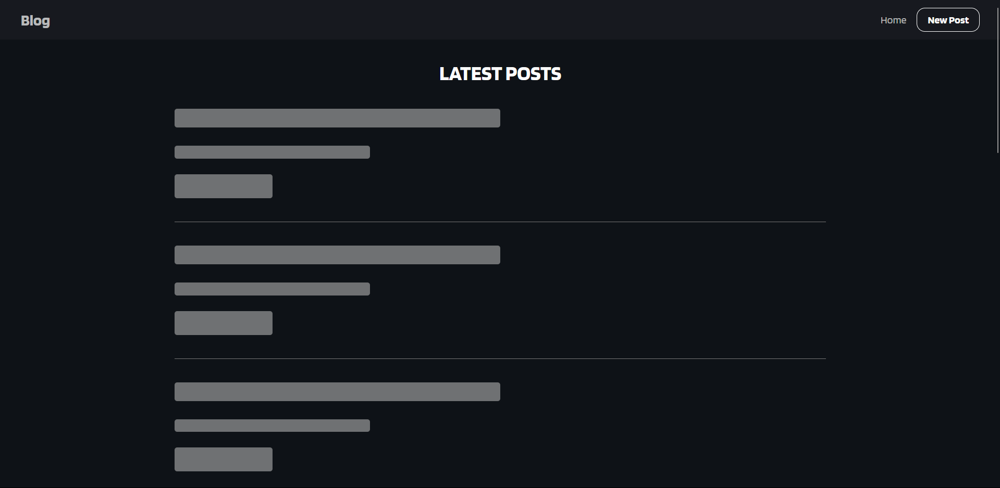

<h1 align="center">🅱️Blog React TS</h1>

## 👀Overview

This repository contains a web application developed using React with TypeScript as the programming language, Vite as the bundler and development server, Axios for HTTP requests, and React Router Dom for route management.

The application is an example application demonstrating the integration of various popular technologies from the React ecosystem for building modern web applications.

## 📤Last Update

Version 0.0.1 -> build: first launch!

🖥 To check the project deployment [click here]()

## 📸 Screenshots

[]()

[]()

[]()

## ⚙️Installation Requirements

Make sure to have Node.js and npm (or yarn) installed on your machine before proceeding with the installation instructions.

- [Node.js](https://nodejs.org/) (version 14 or higher recommended)
- npm or yarn (npm is automatically installed with Node.js or you can choose to manually install yarn)

## 😎Installation

1. Clone this repository to your local environment:

```bash
git clone https://github.com/DanielMendesSensei/Blog-React-TS.git
```

2. Navigate to the application directory:

```bash
cd Blog_React_TS
```

3. Install project dependencies using npm or yarn:

#### With npm:

```bash
npm install
```

#### With yarn:

```bash
yarn
```

## 💽Running the Application

#### With npm:

```bash
npm run dev
```

#### With yarn:

```bash
yarn dev
```

## 📂Project Structure

```
Blog_React_Ts/
├── .github/
├── public/
│   ├── imgs/
│   │   ├── Screenshot1.png
│   │   ├── Screenshot2.png
│   │   ├── Screenshot3.png
├── src/
│   ├── assets/
│   │   ├── imgs/
│   ├── axios/
│   │   ├── config.ts
│   ├── components/
│   │   ├── Footer/
│   │   │   ├── Footer.css
│   │   │   ├── Footer.tsx
│   │   ├── Navbar/
│   │   │   ├── Navbar.css
│   │   │   ├── Navbar.tsx
│   │   ├── Skeleton/
│   │   │   ├── Skeleton.css
│   │   │   ├── Skeleton.tsx
│   │   │   ├── SkeletonHome.tsx
│   ├── routes/
│   │   ├── About/
│   │   │   ├── About.css
│   │   │   ├── About.tsx
│   │   ├── Contact/
│   │   │   ├── Contact.css
│   │   │   ├── Contact.tsx
│   │   ├── Home/
│   │   │   ├── Home.css
│   │   │   ├── Home.tsx
│   │   ├── NewPost/
│   │   │   ├── NewPost.css
│   │   │   ├── NewPost.tsx
│   ├── App.css
│   ├── App.tsx
│   ├── index.css
│   ├── main.tsx
│   └── vite-env.d.ts
├── .eslintrc.cjs
├── .gitignore
├── index.html
├── LICENSE
├── package.json
├── README.md
├── tsconfig.json
├── tsconfig.node.json
└── vite.config.ts
```

## 💪🏾 Contribution

If you want to contribute to this project, follow these steps:

1. Fork the repository.
2. Create a new branch: `git checkout -b my-contribution`
3. Make your changes and send a pull request.

Please follow the [contribution guidelines](./.github/CONTRIBUTING) to ensure a smooth process.

## 📟 Contact

For contact, send me a message on my [Linked-In](https://www.linkedin.com/in/daniel-jose-da-silva-mendes-2bb155192/)

## 🚀 Technologies

This project was developed with the following technologies:

- React
- TypeScript
- Axios
- Vite
- HTML & CSS
- Git e Github

## 📜 License

This project is licensed under the [MIT License.](../LICENSE).
